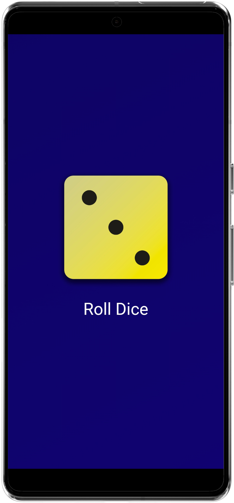

# Roll Dice App

A simple Flutter-based dice rolling application that allows users to roll a dice by pressing a button, changing the dice face randomly with each press.

## My Screens:
  

## Features

- **Roll Dice**: Users can press a button to roll the dice, and the dice face changes randomly.
- **Simple UI**: A straightforward user interface with a dice image and a button to roll the dice.